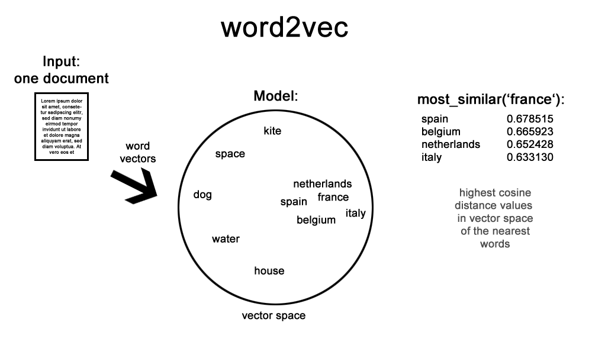

# Sentiment Analysis of Tweets Relating to U.S Airlines Using word2vec



## Abstract

This study presents and discusses experiments in sentiment analysis of Twitter posts relating to U.S airline companies. The goal of this study is to determine whether tweets can be classified either as displaying positive, negative, or neutral sentiment. Word embeddings that are produced by word2vec are generally used to learn context and produce high-dimensional vectors in a space.  These embeddings are then classified using machine-learning algorithms. The challenges of applying word2vec to tweet sentiment classification include using tweet length and syntax to determine the most accurate method to analyze Twitter posts. The highest accuracy for sentiment classification of Twitter posts was 72%. This prediction was achieved with Support Vector Machine and Logistic Regression classifiers, combined with the word2vec skip-gram training model.

## Prerequisites

* Jupyter Notebook == 4.2.1
* Scikit-Learn == 0.19.0
* Gensim == 2.3.0
* NLTK == 3.2.4
* Pandas == 0.19.2
* Matplotlib == 2.0.0
* Seaborn == 0.8.0
* Imbalanced-learn == 0.3.0
* NLTK == 3.2.4
* BeautifulSoup == 4.6.0


## How To Use

To clone and run this notebook, you'll need the prerequisties installed on your computer. From your command line:

```bash
# Clone this repository
$ git clone https://github.com/JoshuaAcosta/CS691-Sentiment-Analysis-Research-Project.git

# Go into the repository
$ cd CS691-Sentiment-Analysis-Research-Project

# Run the notebook
$ jupyter notebook
```
